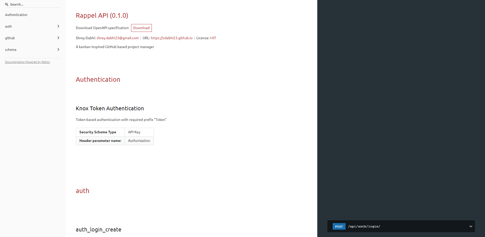

# Rappel

[](https://cloud.digitalocean.com/apps/new?repo=https://github.com/sdabhi23/rappel/tree/master)

An idea management tool, inspired from kanban boards and integrated with GitHub

This repo only contains the backend for the app. Please check [sdabhi23/rappel-ui](https://github.com/sdabhi23/rappel-ui)

## Features

- Automatically sync your GitHub repos
- Sort the repos into 5 categories:
  1. Backlog
  2. Active
  3. Work In Progress
  4. Done
  5. Archive
- Add working notes for the repos directly inside their cards

## Roadmap

- Add notes for new ideas
- Filter repos
- Search repos
- Hide stale repos into a separate tab
- Automatically delete repos when they are deleted from GitHub
- Integration with PyPI and NPM
- Integration with GitLab

## Run locally using Docker

- Generate dependency lists from Pipfile.lock using [jq tool](https://stedolan.github.io/jq/)

  ```bash
  ➜ jq -r '.default | to_entries[] | .key + .value.version' Pipfile.lock > requirements.txt
  ➜ jq -r '.develop | to_entries[] | .key + .value.version' Pipfile.lock > requirements-dev.txt
  ```

- Run the app

  ```bash
  ➜ docker build -t rappel-tst .
  ➜ docker-compose up -d
  ➜ docker run -d --name rappel -p 80:80 --env-file sample.env rappel-tst
  ➜ docker exec -it rappel python manage.py migrate
  ```

The api docs should be available at <http://localhost/api/schema/redoc/>

## Run locally using Pipenv

- Install dependencies using Pipenv

  ```bash
  ➜ pipenv install
  ```

- Run the app

  ```bash
  ➜ pipenv shell
  ➜ cd api/
  ➜ python manage.py migrate
  ➜ python manage.py runserver
  ```

The api docs should be available at <http://localhost:8000/api/schema/redoc/>

## Screenshots

- API Docs

  

## License

```
Copyright 2021 Shrey Dabhi

Licensed under the Apache License, Version 2.0 (the "License");
you may not use this file except in compliance with the License.
You may obtain a copy of the License at

    http://www.apache.org/licenses/LICENSE-2.0

Unless required by applicable law or agreed to in writing, software
distributed under the License is distributed on an "AS IS" BASIS,
WITHOUT WARRANTIES OR CONDITIONS OF ANY KIND, either express or implied.
See the License for the specific language governing permissions and
limitations under the License.
```
